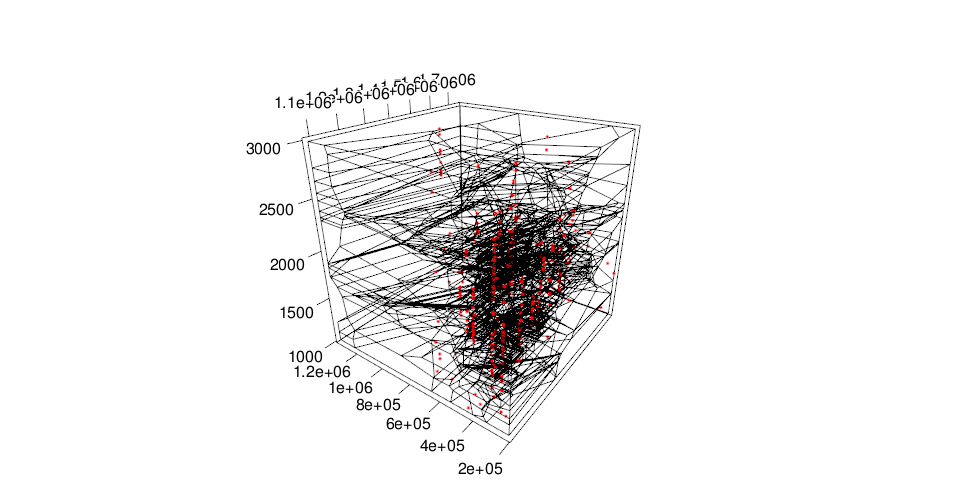
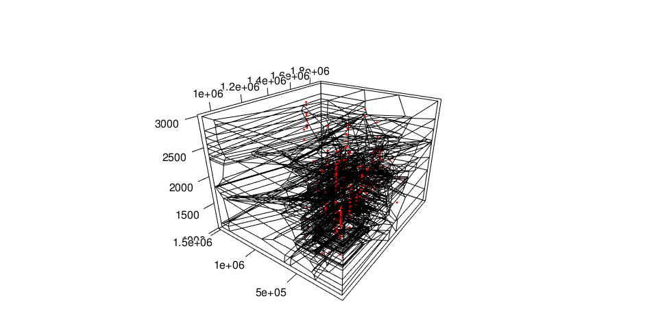

<!-- README.md is generated from README.Rmd. Please edit that file -->

# bleiglas

bleiglas is an R package that provides some helper functions for 3D
tessellation and subsequent cutting of the resulting polygons along one
dimension for plotting. The workflow is described below:

### Get some data

Let’s get some data in three dimension with an arbitrary sample
variable. I decided to use @dirkseidenstickers *Archives des datations
radiocarbone d’Afrique centrale* dataset for this purpose. It includes
radiocarbon datings from Central Africa that combine spatial (x & y) and
temporal (z) information.

<details>

<summary>Click here for details of data preparation</summary>

<p>

``` r
c14_cmr <- c14bazAAR::get_c14data("adrac") %>% 
  dplyr::filter(!is.na(lat) & !is.na(lon), c14age > 1000, c14age < 3000, country == "CMR")
```

    ## 
      |                                                        
      |                                                  |   0%
      |                                                        
      |++++++++++++++++++++++++++++++++++++++++++++++++++|  99%
      |                                                        
      |++++++++++++++++++++++++++++++++++++++++++++++++++| 100%

``` r
coords <- data.frame(c14_cmr$lat, c14_cmr$lon) %>% 
  sf::st_as_sf(coords = c(1, 2), crs = 4326) %>% 
  sf::st_transform(crs = 4088) %>% 
  sf::st_coordinates()

c14 <- c14_cmr %>% 
  dplyr::transmute(
    id = 1:nrow(.),
    x = coords[,1], 
    y = coords[,2], 
    z = c14age * 1000 # rescaling of temporal data
)
```

</p>

</details>

<br>

I selected dates from Cameroon between 1000 and 3000 uncalibrated BP,
projected them on a simple cylindrical projection. Cameroon is so close
to the equator, that this projection should even represent distances,
angles and areas quite correctly. I rescaled the temporal data with a
factor of 1000 to better show the effect of 3D tessellation. You can
imagine the samples to be observations in a 3D geo-time-space where one
year equals one kilometre.

``` r
c14 
```

    ##  Radiocarbon date list
    ##  dates       405 
    ## 
    ## # A tibble: 405 x 4
    ##       id       x        y       z
    ##    <int>   <dbl>    <dbl>   <dbl>
    ##  1     1 450331. 1284303. 1920000
    ##  2     2 450331. 1284303. 2596000
    ##  3     3 450331. 1284303. 2360000
    ##  4     4 450331. 1284303. 2380000
    ##  5     5 434150. 1278776. 2810000
    ##  6     6 434150. 1278776. 2710000
    ##  7     7 434150. 1278776. 1860000
    ##  8     8 434150. 1278776. 1960000
    ##  9     9 434150. 1278776. 2820000
    ## 10    10 434150. 1278776. 2110000
    ## # … with 395 more rows

### 3D tessellation

[Tessellation](https://en.wikipedia.org/wiki/Tessellation) means filling
space with polygons so that neither gaps and nor overlaps occur. This is
an exciting application for art (e.g. textile art or architecture) and
an interesting challenge for mathematics. As a computational
archaeologist I know one particular tessellation algorithm that has
quiet some relevance for geostatistical operations like e.g. spatial
interpolation: Voronoi tilings as produced with [Delaunay
triangulation](https://en.wikipedia.org/wiki/Delaunay_triangulation).
These are tessellations where each polygon covers the space closest to
one of a set of sample points.

<table style="width:100%">

<tr>

<th>

<figure>


<figcaption>

Islamic mosaic with tile tessellations in Marrakech, Morocco.
<a href="https://en.wikipedia.org/wiki/File:Ceramic_Tile_Tessellations_in_Marrakech.jpg">wiki</a>

</figcaption>

</figure>

</th>

<th>

<figure>


<figcaption>

Delaunay triangulation and its Voronoi diagram.
<a href="https://commons.wikimedia.org/wiki/File:Delaunay_Voronoi.svg">wiki</a>

</figcaption>

</figure>

</th>

<th>

<figure>


<figcaption>

Output example of voro++ rendered with POV-Ray.
<a href="http://math.lbl.gov/voro++">math.lbl.gov</a>

</figcaption>

</figure>

</th>

<tr>

</table>

Voronoi tessellation can be calculated not just for 2D surfaces, but
also for higher dimensions. The [voro++](http://math.lbl.gov/voro++/)
software library does exactly this for 3D space.
`bleiglas::tessellate()` is a very minimal wrapper function that calls
the voro++ command line interface for datasets like the one introduced
above.

``` r
raw_voro_output <- bleiglas::tessellate(c14[, c("id", "x", "y", "z")])
```

    Container geometry        : [213124:1.35658e+06] [1.08714e+06:1.75688e+06] [1.01e+06:2.99e+06]
    Computational grid size   : 5 by 3 by 8 (estimated from file)
    Filename                  : /tmp/Rtmpcqs4Vq/file64b2461d69e0
    Output string             : %i§%P§%t
    Total imported particles  : 399 (3.3 per grid block)
    Total V. cells computed   : 353
    Total container volume    : 1.51632e+18
    Total V. cell volume      : 1.40304e+18

The output of voro++ is highly customizable, but structurally complex. I
focussed on the edges of the resulting 3D polygons and wrote a parser
function `bleiglas::read_polygon_edges()` that can transform the output
to a tidy data.frame with the coordinates (x, y, z) of the start (a) and
end point (b) of each polygon edge.

``` r
polygon_edges <- bleiglas::read_polygon_edges(raw_voro_output)
```

    ## # A tibble: 21,986 x 7
    ##       x.a     y.a     z.a    x.b     y.b     z.b    id
    ##     <dbl>   <dbl>   <dbl>  <dbl>   <dbl>   <dbl> <dbl>
    ##  1 213124 1087140 1010000 213124 1087140 1121520    43
    ##  2 213124 1087140 1010000 335336 1087140 1010000    43
    ##  3 213124 1087140 1010000 213124 1334410 1010000    43
    ##  4 215243 1352160 1183610 213124 1352900 1183750    43
    ##  5 215243 1352160 1183610 356316 1130520 1134280    43
    ##  6 215243 1352160 1183610 242959 1339430 1126700    43
    ##  7 363436 1087140 1120260 368333 1117300 1121420    43
    ##  8 363436 1087140 1120260 358949 1087140 1124170    43
    ##  9 363436 1087140 1120260 352272 1087140 1054060    43
    ## 10 213124 1334410 1010000 327271 1213480 1010000    43
    ## # … with 21,976 more rows

plot edges and data

``` r
polygon_edges %<>% dplyr::mutate(
  z.a = z.a / 1000,
  z.b = z.b / 1000
)

c14 %<>% dplyr::mutate(
  z = z / 1000
)
```

3d plot with sample points and polygons

``` r
rgl::axes3d()
rgl::points3d(c14$x, c14$y, c14$z, color = "red")
rgl::aspect3d(1, 1, 1)
rgl::segments3d(
  x = as.vector(t(polygon_edges[,c(1,4)])),
  y = as.vector(t(polygon_edges[,c(2,5)])),
  z = as.vector(t(polygon_edges[,c(3,6)]))
)
```

<!-- -->

``` r
cut_surfaces <- bleiglas::cut_polygons(polygon_edges, c(2500, 2000, 1500), crs = 4088)
```

``` r
cut_surfaces %>%
  ggplot() +
  geom_sf(
    aes(fill = time), 
    color = "white",
    lwd = 0.2
  ) +
  facet_wrap(~time) +
  theme_bw() +
  theme(
    axis.text = element_blank(),
    axis.ticks = element_blank()
  )
```

<!-- -->
